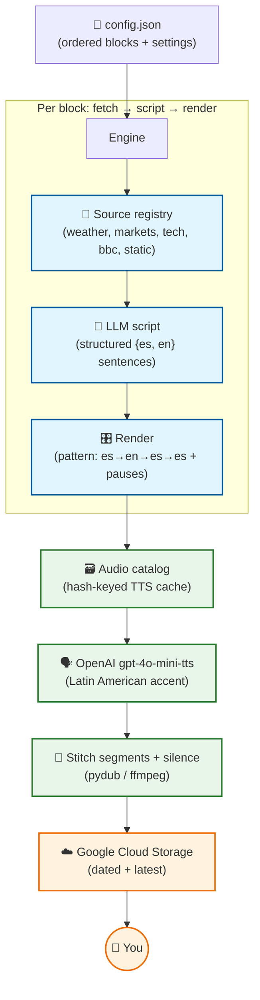

# daily-audio-update

A configurable **language-drill** audio generator. It builds a daily MP3 you listen to on your phone, where each sentence is drilled for learning: spoken in your target language (Spanish), then its English translation, then repeated in the target language — with a pause after every line so you can shadow it out loud.

The briefing is assembled from an ordered list of **blocks** (greeting, date, weather, news, …). Each block fetches data, turns it into short beginner sentences via an LLM, and renders audio from a reusable segment cache. The result is uploaded to Google Cloud Storage under a stable "latest" URL your iPhone alarm can play.

## iPhone Morning Alarm Setup

The video below demonstrates how to configure an iPhone Shortcut to wake you up with this daily briefing.

<video src="docs/audiogram.mp4" controls title="iPhone Alarm Shortcut Setup"></video>

## How it works

Each **block** runs a three-stage pipeline, then all segments are stitched into one MP3:



## Features

- **Learning by repetition**: every sentence plays `target → native → target → target`, with a pause after each line (`max(previous line × 1.5, 1s)`) so you can repeat it aloud. The pattern, repeats, voices, and pauses are configurable per block.
- **Block-based config**: `config.json` is an ordered array of blocks. Add a block, reorder, or toggle one on/off without touching code — designed so a future UI can edit it.
- **Pluggable sources**: a block's `source` maps to a registered fetcher. Adding a data source = one function + one registration.
- **Audio catalog**: generated speech is cached by content hash. Repeated lines (within a sentence, or recurring across days) are served from cache — near-zero cost and latency.
- **Graceful degradation**: a failing source skips its block and the run continues. If *everything* fails, nothing is uploaded, so the stable "latest" file (which leads with today's date) never goes stale silently.

## Setup

1. Install [`uv`](https://docs.astral.sh/uv/) and **ffmpeg** (required for audio stitching):
   - macOS: `brew install ffmpeg`
   - Debian/Ubuntu: `apt install ffmpeg`
2. Copy the config templates and fill them in:
   ```bash
   cp .env.example .env                  # secrets: OPENAI_API_KEY, GCS_BUCKET_NAME
   cp config.example.json config.json    # blocks, language, voices, per-block settings
   ```
3. Sync dependencies: `uv sync`

## Usage

```bash
uv run main.py              # generate today's briefing and upload it
uv run main.py --dry-run    # fetch + script only; print the segment timeline (no audio)
uv run main.py --no-upload  # generate locally, skip the GCS upload
```

To choose a Spanish voice by ear, generate samples and listen:

```bash
uv run scripts/voice_samples.py   # writes samples/voice_*.mp3
```

## Configuration

- **`.env`** — secrets and machine specifics only (`OPENAI_API_KEY`, `GCS_BUCKET_NAME`, optional `OPENROUTER_API_KEY`).
- **`config.json`** — all behaviour: user, language/dialect, default pattern/voices, and the ordered `blocks`. See `config.example.json`. It is validated on startup (unknown source, bad language code, missing voice, etc. fail with a clear message before any API call).

A block looks like:

```json
{
  "id": "weather",
  "source": "weather",
  "prompt": "Summarise today's weather in two short sentences a beginner can follow.",
  "target_sentences": 2,
  "enabled": true,
  "pattern": ["es", "en", "es", "es"],
  "settings": { "lat": 51.21, "lon": -0.79, "location": "Farnham" }
}
```

`static` blocks (greeting, date, sign-off) carry their sentences inline with template variables: `{name}`, `{date_es}`, `{date_en}`, `{weekday_es}`.

See `docs/features/language-drill-engine.md` for the full design and decisions.
