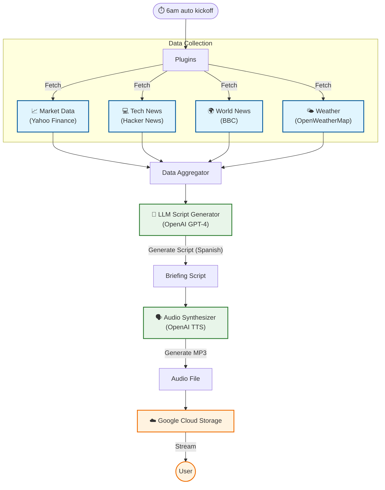

# daily-audio-update

An automated personal briefing system that generates a daily MP3 podcast covering market data, tech news, world news, and weather. The briefing is narrated in Spanish (or your target language) via OpenAI to help with language learning, and automatically uploaded to Google Cloud Storage.

## Architecture



## Features

- **Personalized Data**: Fetches specific data points you care about (Stocks, Tech, Weather).
- **Language Learning**: Translates the briefing into your target language (default: Spanish).
- **High-Quality Audio**: Uses OpenAI's TTS for natural-sounding narration.
- **cloud Access**: Uploads to Google Cloud Storage for easy access via specific or "latest" links.

## Usage

1.  Configure `.env` with API keys and preferences.
2.  Run the main script:
    ```bash
    uv run main.py
    ```
